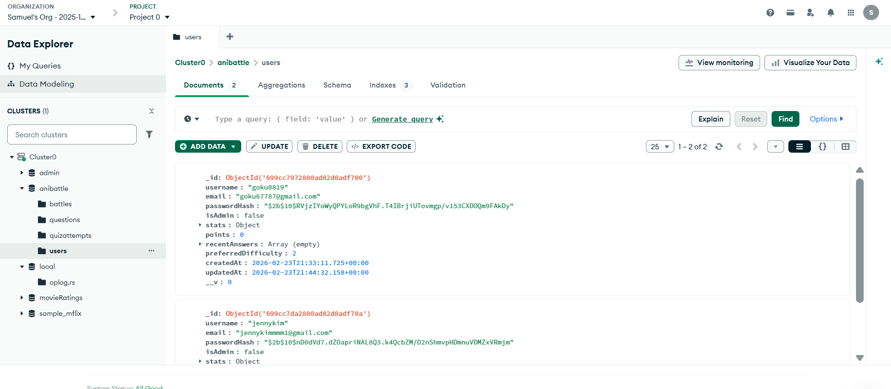
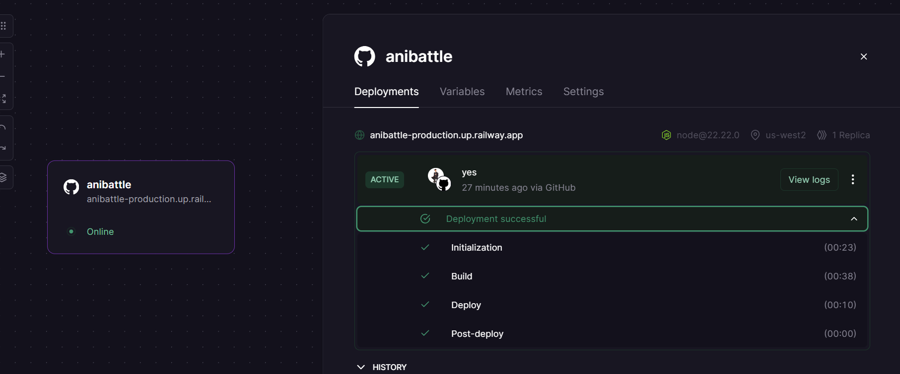
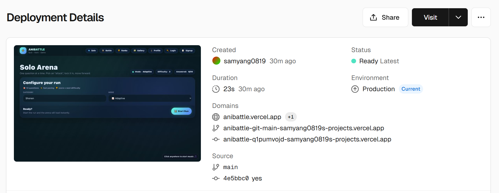
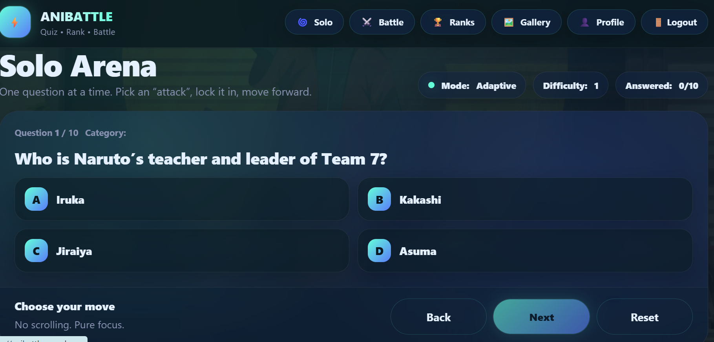
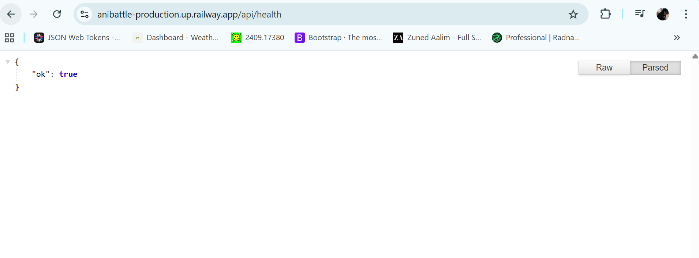

# 📓 AniBattle Development Log (DevLog)

This document outlines the weekly development progress, challenges encountered, solutions implemented, and key technical insights gained during the development of AniBattle.

---

# 🗓 Week 1 — Architecture & Backend Foundation

## Goals
- Define project scope
- Design system architecture
- Set up backend server
- Connect MongoDB Atlas

## Work Completed
- Created Express server structure
- Implemented modular route architecture:
  - `/api/auth`
  - `/api/quiz`
  - `/api/users`
  - `/api/leaderboard`
- Configured MongoDB Atlas cloud database
- Implemented Mongoose models
- Created centralized error handler

## Key Code Milestone

Example of REST route modularization:

```js
app.use("/api/auth", authRoutes);
app.use("/api/quiz", quizRoutes);
app.use("/api/users", userRoutes);
```

## Challenges Faced
- Understanding how to structure a scalable backend
- Configuring MongoDB Atlas connection string correctly
- Managing environment variables securely

## Solution
- Used separation of concerns (routes, models, controllers)
- Isolated environment variables using dotenv
- Tested database connectivity independently before integrating routes

## Key Learnings
- A clear architecture early prevents debugging chaos later
- Environment variables should never be committed
- Modular routes improve maintainability

---

# 🗓 Week 2 — Authentication & Quiz Logic

## Goals
- Implement JWT authentication
- Protect routes
- Build quiz generation logic
- Implement scoring system

## Work Completed
- Implemented JWT token generation
- Created protected middleware
- Built quiz start endpoint
- Implemented answer submission and scoring logic
- Designed adaptive difficulty system

## Key Code Milestone

JWT Authentication:

```js
const token = jwt.sign(
  { id: user._id },
  process.env.JWT_SECRET,
  { expiresIn: "7d" }
);
```

Quiz submission scoring:

```js
const score = correctAnswers;
const accuracy = score / totalQuestions;
```

## Challenges Faced
- Debugging token verification errors
- Ensuring correct question IDs were passed during submission
- Handling unanswered questions safely

## Solution
- Added middleware-based token validation
- Mapped Mongo `_id` correctly in submission
- Defaulted unanswered values to -1 before submission

## Key Learnings
- Authentication flows must be tested end-to-end
- MongoDB documents use `_id`, not `id`
- Backend validation is critical for integrity

---

# 🗓 Week 3 — Frontend UI & Adaptive Flow

## Goals
- Build Solo Arena interface
- Implement question navigation system
- Integrate frontend with backend
- Improve UX and state management

## Work Completed
- Built React components using hooks
- Implemented one-question-at-a-time UX
- Built progress HUD
- Connected API layer using environment variable
- Implemented loading states and error handling

## Key Code Milestone

API abstraction:

```js
export async function api(path, options = {}) {
  const base = import.meta.env.VITE_API_URL;
  const res = await fetch(`${base}${path}`, {
    headers: { "Content-Type": "application/json" },
    ...options,
  });
  return res.json();
}
```

Question navigation state:

```js
const [idx, setIdx] = useState(0);
const q = quiz?.questions?.[idx];
```

## Challenges Faced
- Handling async loading states cleanly
- Managing multi-step question flow
- Preventing submission without answering all questions

## Solution
- Used `useState` and `useMemo` strategically
- Disabled submit until all questions answered
- Built conditional rendering logic for result view

## Key Learnings
- UI state logic must align with backend payload shape
- Conditional rendering avoids unnecessary rerenders
- Abstraction of API calls simplifies scaling

---

# 🗓 Week 4 — Deployment & Production Debugging

## Goals
- Deploy backend (Railway)
- Deploy frontend (Vercel)
- Configure MongoDB Atlas
- Fix CORS and production environment variables

## Work Completed
- Deployed backend to Railway
- Configured MongoDB Atlas IP whitelist
- Deployed frontend to Vercel
- Configured environment variables for production
- Fixed CORS policy errors
- Debugged preflight request failures

## Major Production Issue

CORS Error:
```
No 'Access-Control-Allow-Origin' header is present
```

## Solution

Updated backend CORS configuration:

```js
app.use(cors({
  origin: process.env.CLIENT_ORIGIN,
  credentials: true
}));
```

Configured Railway variable:

```
CLIENT_ORIGIN=https://anibattle.vercel.app
```

Updated Vercel variable:

```
VITE_API_URL=https://anibattle-production.up.railway.app/api
```

## Key Learnings
- Production environment differs significantly from local
- CORS must match exact frontend domain
- MongoDB Atlas requires IP whitelisting
- Deployment debugging requires reading logs carefully

---

# 📸 Important Milestones 
1. MongoDB Atlas cluster configuration

2. Railway deployment logs

3. Vercel deployment dashboard

4. Solo Arena working in production

5. CORS error debugging in DevTools
6. Successful health check endpoint


---

# 🔍 Overall Reflection

This project strengthened my understanding of:

- Full-stack system architecture
- REST API design
- Secure authentication practices
- Production deployment pipelines
- Debugging distributed systems
- Environment variable management
- Cloud database configuration

The most valuable learning was understanding how frontend, backend, and database interact in a real deployment environment.

AniBattle evolved from a local prototype into a production-ready full-stack application.

---

# 🚀 Future Direction

If extended further, the project would include:

- Real-time multiplayer battles using WebSockets
- Admin dashboard for question management
- Performance analytics dashboard
- Caching layer for scaling
- Role-based permissions system